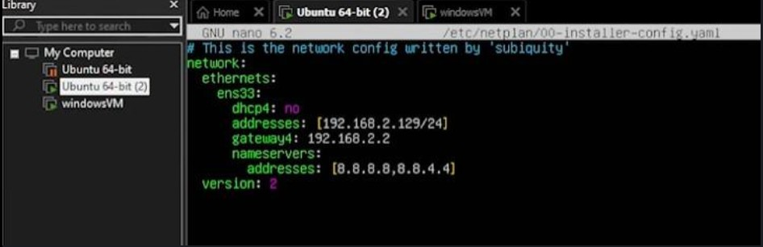
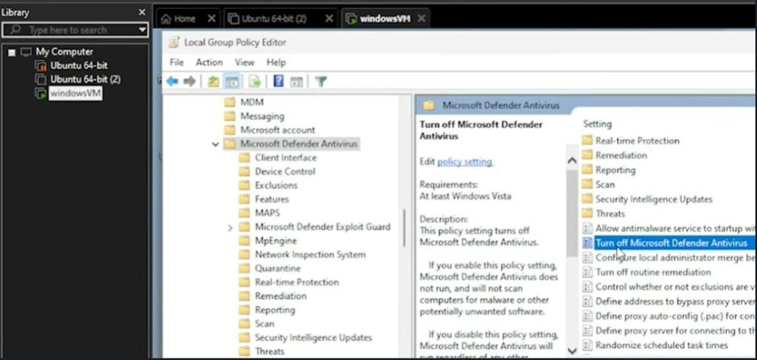
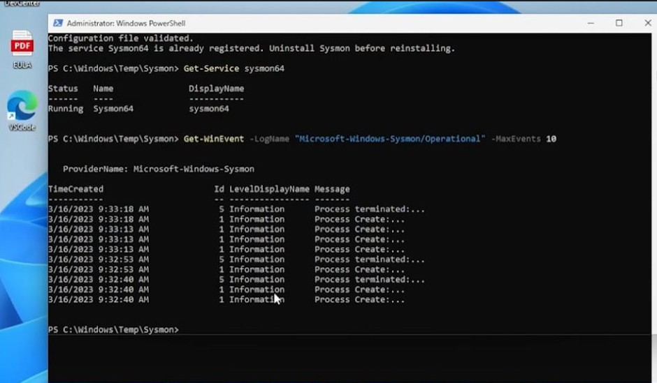
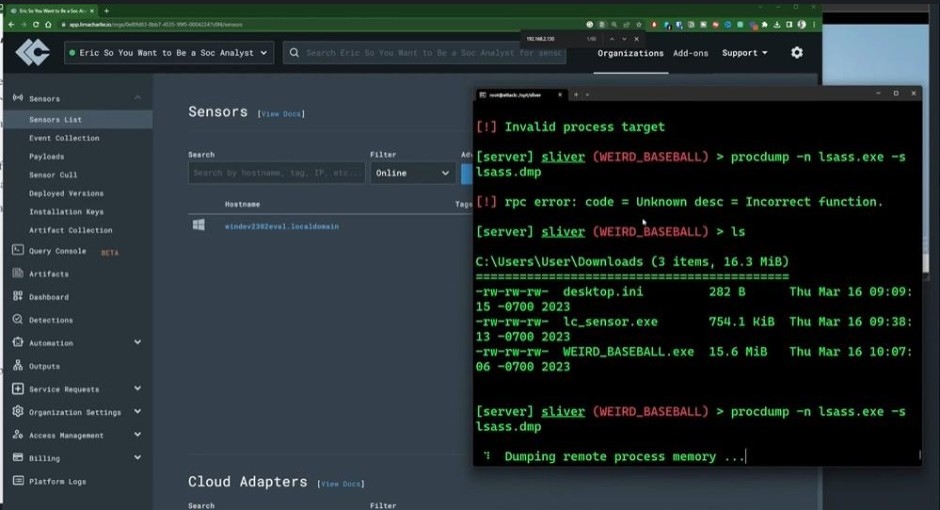
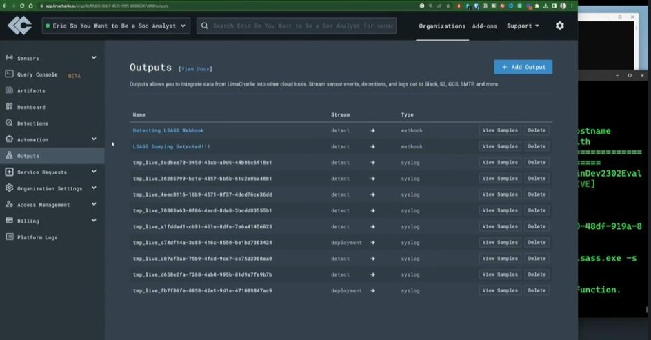
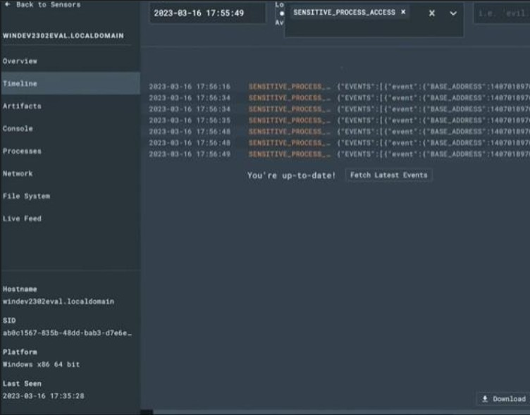
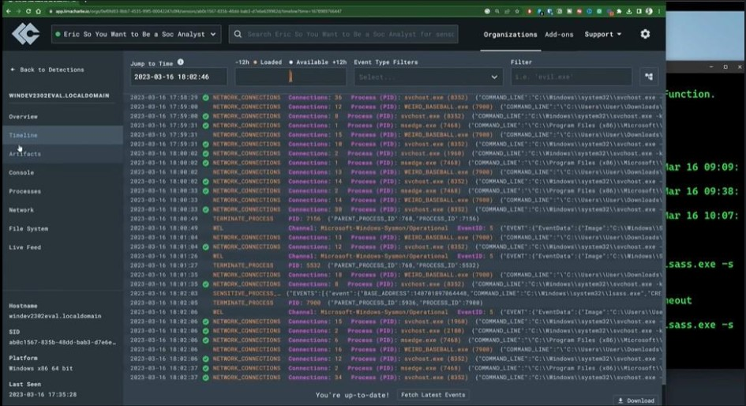
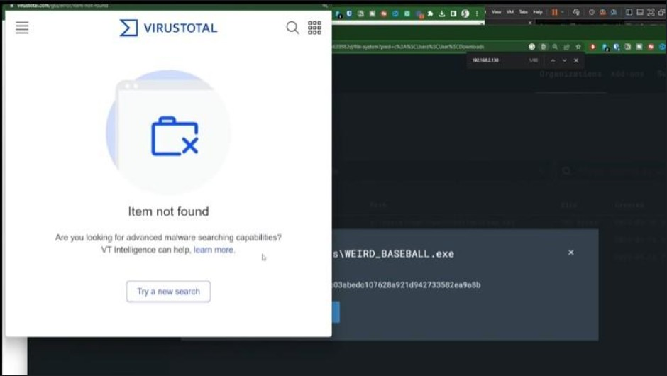

# SOC Detection & Incident Response Lab

> A hands-on SOC detection engineering lab simulating a real-world credential-theft attack against a Windows endpoint, with EDR telemetry, live detections, and full incident triage using LimaCharlie. Built on Eric Capuano's *So You Want to Be a SOC Analyst?* series.

**Built by:** Shaho Ahmed | Cybersecurity Engineer | Detection Engineering | SOC  
**GitHub:** [shahoahmed](https://github.com/shahoahmed) | **LinkedIn:** [shaho-ahmed](https://linkedin.com/in/shaho-ahmed)

---

## Why This Project

Credential theft is the number one intrusion vector, and LSASS memory dumping is one of the most common techniques active threat actors use to harvest credentials after gaining a foothold. This lab was built to demonstrate the full SOC detection loop hands-on: stand up the environment, execute the attack, capture the telemetry, catch it with EDR detections, and triage the incident end to end.

The lab follows Eric Capuano's *So You Want to Be a SOC Analyst?* series. Credit for the lab design and attack scenario goes to Eric Capuano; the environment build, attack execution, detection review, and investigation documented here are my own hands-on work. Every technique is mapped to MITRE ATT&CK.

---

## Lab Architecture

```
[Ubuntu Attacker]                    [Windows 11 Victim]
   Sliver C2                           Sysmon + LimaCharlie EDR
   192.168.2.129                       192.168.2.130
        |                                     |
        |            Lab Network              |
        |_____________________________________|
                          |
                  [LimaCharlie Cloud]
                  Detections + Timeline + Outputs
```

Attacker VM runs on Ubuntu 22.04 (VMware Workstation); victim is Windows 11 Enterprise. All activity is contained on an isolated lab network with no production exposure.

---

## Lab Environment Screenshot



*Lab network configuration on the isolated 192.168.2.0/24 subnet*

---

## Attack Chain Executed

All techniques are mapped to MITRE ATT&CK and executed from the Sliver C2 server.

| Technique | MITRE ID | Tool Used | Description |
|---|---|---|---|
| Impair Defenses | T1562.001 | Group Policy / regedit | Disabled Microsoft Defender so the payload could execute |
| Command and Control | T1071 | Sliver | Established a C2 session via the implant (WEIRD_BASEBALL.exe) |
| Malicious Execution | T1204 | Sliver implant | Ran the attacker payload on the victim endpoint |
| LSASS Credential Dump | T1003.001 | procdump | Dumped LSASS process memory to extract credentials |

---

## Attacker Foothold: Disabling Defender

To let the attack execute in a controlled lab, Microsoft Defender real-time protection, tamper protection, cloud-delivered protection, and the corresponding Group Policy setting were disabled. This mirrors what an attacker attempts after gaining a foothold, and it shifts the burden from prevention to **detection** via EDR.



*Microsoft Defender disabled via Group Policy (T1562.001)*

---

## Telemetry Pipeline

```
Windows Security Logs + Sysmon Events
              |
      LimaCharlie EDR Sensor
              |
      LimaCharlie Cloud
   (Detections + Timeline + Outputs)
```

**Endpoint telemetry:** Sysmon + Windows Event logs feeding the LimaCharlie sensor.

### Live Telemetry Screenshot



*Sysmon running on the endpoint and generating process/event telemetry into LimaCharlie*

---

## Attack Evidence



*Sliver C2 session on the victim, using procdump to dump LSASS process memory (T1003.001)*

---

## Detection Engineering

With Defender disabled, detection relied entirely on EDR telemetry. LimaCharlie detection rules fired on the LSASS access and dumping activity, and a webhook output was configured to forward detections downstream, the same alert-routing pattern used in a production SOC.

**Detection focus:**
- Sensitive process access to LSASS (T1003.001)
- LSASS memory dumping via procdump
- Suspicious process execution and outbound C2 connection

### Detection Firing Screenshot



*LimaCharlie detections firing on the LSASS dumping activity, with webhook output configured to forward alerts*

---

## Triage and Investigation

Investigated the incident by pivoting through the LimaCharlie timeline, process tree, and network data to reconstruct the attack, then enriched the payload hash against VirusTotal.

### Sensitive Process Access Telemetry



*SENSITIVE_PROCESS_ACCESS events showing the underlying telemetry behind the detection*

### Timeline Investigation



*Reconstructing the attack across process, network, and file-system events in the LimaCharlie timeline*

### Artifact Enrichment



*Enriching the payload hash against VirusTotal during triage*

---

## Tech Stack

| Category | Tools |
|---|---|
| EDR / SIEM | LimaCharlie (endpoint sensor + cloud console) |
| Endpoint Telemetry | Sysmon + Windows Event logs |
| Virtualization | VMware Workstation |
| Operating Systems | Ubuntu 22.04, Windows 11 Enterprise |
| C2 Framework | Sliver |
| Attack Tooling | procdump (LSASS memory dump) |
| Enrichment | VirusTotal |
| Detection | LimaCharlie detection rules (MITRE ATT&CK mapped) |

---

## Repository Structure

```
soc-detection-lab/
|
|-- screenshots/
|   |-- 01-network-setup.jpg
|   |-- 02-sysmon-telemetry.jpg
|   |-- 03-defender-disabled.jpg
|   |-- 04-lsass-attack.jpg
|   |-- 05-detection-fired.jpg
|   |-- 06-process-access-events.jpg
|   |-- 07-triage-timeline.jpg
|   |-- 08-virustotal-enrichment.jpg
|
|-- README.md
```

---

## Key Results

- Built a multi-VM attacker/victim environment with isolated lab networking
- Deployed Sysmon and a LimaCharlie EDR sensor and validated live telemetry into the cloud console
- Executed a full C2 attack chain (Sliver implant to LSASS credential dump via procdump)
- Detected the credential-dumping activity through EDR detections with webhook alert forwarding
- Triaged the incident end to end, pivoting across process, network, and file-system telemetry
- Enriched the payload artifact against VirusTotal to complete the investigation

---

## MITRE ATT&CK Coverage

| Tactic | Technique | ID |
|---|---|---|
| Defense Evasion | Impair Defenses: Disable or Modify Tools | T1562.001 |
| Command and Control | Application Layer Protocol | T1071 |
| Execution | User Execution: Malicious File | T1204 |
| Credential Access | OS Credential Dumping: LSASS Memory | T1003.001 |

---

## Lab Setup

- Attacker: Ubuntu 22.04 running the Sliver C2 server (`192.168.2.129`)
- Victim: Windows 11 Enterprise with Sysmon and the LimaCharlie sensor (`192.168.2.130`)
- Implant: `WEIRD_BASEBALL.exe`, delivered and executed from the C2 server
- Network: isolated lab subnet, no internet exposure during the attack

---

## Portfolio Labs

These are my most recent completed labs. Each one was built hands-on, documented end to end, and grounded in real-world attacker techniques. I learned something new in every single one and the full process is here for you to see.

Check them out and if you are just as passionate and curious about this field as I am, connect with me on LinkedIn. Always open to meeting like-minded people in the security community.

- [AI-Augmented AD Identity Attack Detection Lab](https://github.com/shahoahmed/ad-identity-attack-detection-lab) - Custom Elastic SIEM detection rules, Python ML alert scoring, and local LLM triage via Ollama
- [SOC Detection & Incident Response Lab](https://github.com/shahoahmed/soc-detection-lab) - LimaCharlie EDR detection and full incident triage of a live LSASS credential-theft attack
- [Pi-hole Network DNS Lab](https://github.com/shahoahmed/pihole-network-dns-lab) - Self-hosted network-wide ad blocking with DNS-level threat filtering across all home devices

---

## Credit

Lab design, attack scenario, and methodology from Eric Capuano's *So You Want to Be a SOC Analyst?* series. This repository documents my own hands-on completion, execution, and investigation of that lab.

**Connect:** [LinkedIn](https://linkedin.com/in/shaho-ahmed) | [GitHub](https://github.com/shahoahmed)
